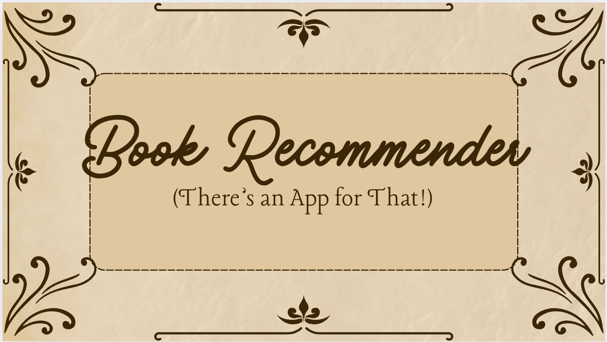
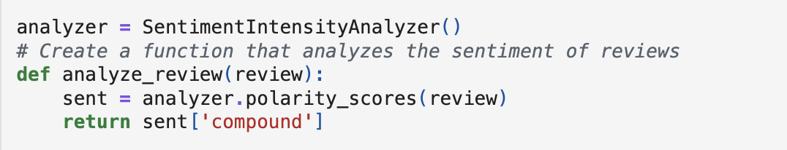
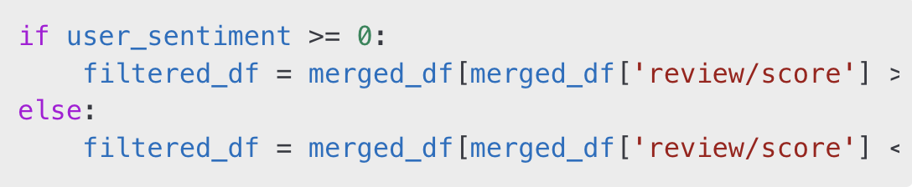

<p align="center">
  
</p>

# 📌 Executive Summary

In today's digital age, finding the perfect book can be overwhelming with millions of options available. This project tackles that challenge by developing an intelligent Book Recommender System that personalizes book suggestions based on user preferences, ratings, and reviews. By leveraging machine learning, natural language processing, and data analysis, this system helps users discover books that align with their tastes—whether they’re looking for the next bestseller, a hidden gem, or a niche favorite. This analysis delves into the inner workings of our Jupyter Notebook implementation, breaking down how data is processed, recommendations are generated, and insights are drawn.

# 📂 Installation & Usage

### Prerequisites

Ensure you have the following dependencies installed:

- Python 3.x
- pandas
- numpy
- scikit-learn
- Keras
- Keras
- Gradio
- VADER via nltk
- Jupyter Notebook
- Git version control system
- Internet connection for data downloads

### Setup

1. Clone the repository:
  
   ```bash
   git clone <rhttps://github.com/lmc5440/BookRecommender.git>
   ```

2. Install the required dependencies:
   ```bash
   pip install -r requirements.txt
   ```
3. Launch Jupyter Notebook and open `book_recommendation.ipynb`


# 📂 Data Preparation

### Datasets Used

1. **Goodreads Dataset (****`goodreads_dataset.csv`****)** [Link](https://www.kaggle.com/datasets/leireher/goodreads-books-with-description-and-genre?select=book_dataset.csv)
2. **Amazon Books Reviews (****`book_reviews.csv`****)** [Link](https://www.kaggle.com/datasets/mohamedbakhet/amazon-books-reviews)

These datasets contain book descriptions, reviews, authors, genres, and ratings, which help generate meaningful recommendations

### Data Cleaning Process

1. Remove Duplicates: Ensured unique book entries.
2. Format Text Data: Reformatted genres and author fields.
3. Text Preprocessing: Converted text to lowercase, removed punctuation and stopwords, applied tokenization.
4. Merge Datasets: Combined metadata and review scores into a structured dataset.


# 🏗️ Model Methodology

### 1. Data Preprocessing

- **Loading Data**: The notebook uses `pandas.read_csv()` to load the datasets.
- **Handling Missing Values**: It identifies and removes missing or null values to ensure data consistency.
- **Text Processing**: 
   * `nltk` library is used for tokenization, stopword removal, and stemming to refine text data.  
   * `TF-IDF Vectorization`converts book descriptions into numerical vectors.  
   * `Stopword Removal & Tokenization`improves similarity matching.

### 2. Exploratory Data Analysis

- Visualizing rating distributions and popular books using matplotlib and seaborn.
-  Analyzing user engagement trends and sentiment in reviews.

### 3. Sentiment Analysis

- `VADER Sentiment Analyzer`determines review sentiment to refine book recommendations.

- Filtering Recommendations Based on Sentiment: Ensures that recommendations match user sentiment.

### 4. Book Recommendation Algorithms

#### Content-Based Filtering

- **Feature Extraction**: The notebook utilizes `TfidfVectorizer` from `sklearn.feature_extraction.text` to convert book descriptions into numerical vectors.  
- **Cosine Similarity Calculation**: Using `sklearn.metrics.pairwise.cosine_similarity`, it computes similarity scores between books.
- **Recommendation Generation**: Based on similarity rankings, the system suggests the Top 3 books with the highest similarity to the user's input.


#### Collaborative Filtering

* Constructs a user-item rating matrix.
* Applies Singular Value Decomposition (SVD) to predict user preferences.

#### K-Nearest Neighbors Model

* Create a KNN model and fit the vectorized book data.
* Find the k most similar books to recommend based on the user’s input.

#### Hybrid Recommendation Approach
The Switching Hybrid Approach implemented in this notebook alternates between content-based filtering and sentiment-based filtering based on user input. The system dynamically selects either content-based filtering or sentiment-based filtering, depending on user input. It does not blend multiple methods simultaneously but picks the most suitable approach.

How it works:
   1. The user enters a book title and review.
   2. Sentiment Analysis determines the tone of the review using `VADER`:

      

   3. Filtering Based on Sentiment:

      - If positive sentiment (score ≥ 0), books with ratings ≥ 4 are recommended.
      - If negative sentiment (score < 0), books with ratings < 4 are recommended.
      
         
   
   4. Content-Based Filtering: After filtering,`TF-IDF Vectorization` + `Cosine Similarity` is applied to recommend books most textually similar to the user’s review.
   
   5. KNN Algorithm: As a second approach, `k-nearest neighbors` model is built to find most similar books based on the user's review.

## 📊 Model Evaluation & Key Findings

- **Review text** and **book descriptions** were the most significant factors in determining book recommendations.

- **Sentiment Analysis** played a crucial role in filtering appropriate book suggestions based on the user's mood.

- **The TF-IDF + Cosine Similarity model** provided strong recommendations, successfully suggesting highly relevant books.

- **Popular books tend to have higher ratings but also more polarized reviews.**

- **Collaborative filtering** captures personalized preferences but requires a large dataset to be effective.

- **Content-based filtering** performs well in suggesting books with similar themes but lacks personalization.

- **Hybrid approaches** could improve recommendation quality by combining both methods.

## 🌐 Interactive Visualization with Gradio

This book recommender system is deployed using `Gradio`, allowing users to input a book title and review to receive personalized recommendations in a user-friendly web interface.

### User input and recommendations and alternative recommendations on another submission:
<p align="center">
  

  <p align="center">
  
</p>

### The interactive interface allows users to:

- Enter a book title and review.  
- et real-time book recommendations based on content similarity and sentiment analysis.
- Submit multiple times to explore different recommendations.
- Provide feedback with a flagging option.

## ⚠️ Challenges Encountered  

### While building the recommendation system, we encountered the following challenges:  
- **False Positives & False Negatives**: Some books were recommended due to misleading sentiment analysis.  
- **Data Imbalance**: More reviews exist for popular books, making niche book recommendations more difficult.  
- **Text Complexity**: Some book descriptions were too short, impacting the accuracy of similarity calculations. 

### Key Findings

- Popular books tend to have higher ratings but also more polarized reviews.
- Collaborative filtering captures personalized preferences but requires a large dataset to be effective.
- Content-based filtering performs well in suggesting books with similar themes but lacks personalization.
- Hybrid approaches could improve recommendation quality by combining both methods.

# 🚀 Future Improvements

- **Incorporate Deep Learning**: Experiment with neural networks for improved recommendation accuracy.
- **Enhanced Sentiment Analysis**: Use NLP techniques to assess review sentiment and refine suggestions.
- **Web Deployment**: Implement the model in a Flask or Django web app for user-friendly access.

# 👥 Contributors

- Lauren Christiansen: Project Lead
- Ser Yoon: Engineer
- Thomas Tsai: Engineer
- Laetitia Germe Jones: Engineer


# 🙏 Acknowledgments

- Data Providers: Kaggle, Amazon, and GoodReads for their datasets.
- Academic Advisors: Provided insights into sentiment analysis and recommendation algorithms.

